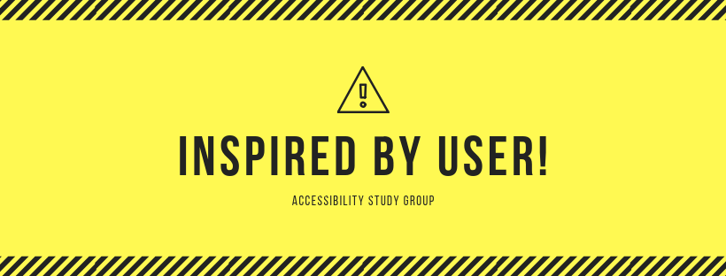

---
<!-- _paginate: false -->
# ご挨拶と会場およびイベント説明
---
## 🚻トイレ
1. 部屋を出て
2. エレベーターホールを抜け
3. 左手にあります
4. アテンドが必要な方、ご案内いたしますので、お声がけください
---
## 🔌 電源 📶 WiFi
- 会場の都合により、提供することができません
## 🚭 喫煙
- 館内は禁煙です
- 喫煙スペース: 地下1階にございます。喫煙はそちらでお願いします
---
## 📹 動画撮影
- 本日の講演とプロジェクターは、録画しています
- 本日、会場に来ることができない方のために後日公開予定です
- 参加者のプライバシー保護のため、参加者を撮影する予定はありませんが、 QAやディスカッションの際にはご注意ください
- あらかじめご了承いただきますよう、よろしくお願いいたします。
---
## 👋 お帰りの際は
18時30分以降は、このビルの1階の玄関が閉まります。
1. エレベーターで地下1階まで降り
2. イタリアンレストランを通り抜けて
3. 階段で地上におあがりください。
---
## ざっくりタイムテーブル

- 19時00分〜19時5分   挨拶と会場説明およびイベント説明
- 19時5分〜19時20分 INSPIRED BY USER! 立ち上げの思いとアクセシビリティについて(若干時間オーバー予定)
- 19時20分〜19時30分 休憩
- 19時30〜20時20分  見えない人はどのようにスマホを利用しているのか	京都福祉情報ネットワーク 代表 園 順一 氏
- 20時30分〜20時40分    休憩
- 20時40分〜21時00分    質疑応答およびディスカッション
- 21時00分〜22時頃  懇親タイム♪(当会場)

---

## 📄アンケートへの回答をお願いします
