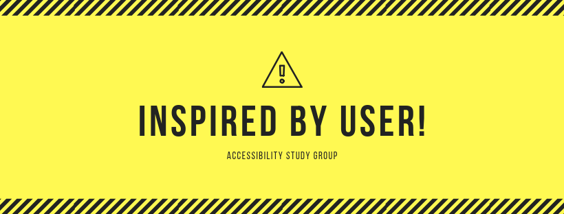

---
<!-- _paginate: false -->
# INSPIRED! 立ち上げの思いと講師のご紹介
---
## 自己紹介
<!-- _paginate: false -->

- クラスメソッドCX事業本部
- 入社1年とちょっと
- モバイルアプリ/Webアプリの受託開発
- 2002年からアクセシビリティを研究
- ウェブアクセシビリティ基盤委員会 WG4(翻訳) 作業協力者
---
## INSPIRED! 立ち上げの思い

1. アクセシビリティの大切さを知るには当事者の利用状況を見るのが一番だ！
2. Web以外にもアクセシビリティは必要だ！
3. 日本の**モバイルアプリやWebアプリ**をアクセシブルにしたい！
4. アクセシビリティの問題を知るには、アクセシブルでないアプリを取り上げざるを得ない
---
## 持田とアクセシビリティとの出会い(1)

2002年頃 → 歴史をお話すると、ほぼWebアクセシビリティの歴史に(笑)

- 最初は自分のサイトのCSSに凝っていた
- IEとNetscapeで見た目を同じにするCSSとか
- ある日、ヨドバシ梅田で「ホームページ・リーダー」を購入
- 自分のサイトを読み上げさせてみた
- 目をつぶって利用すると「読み上げで理解しやすいサイト」のノウハウ得られた
---
## よりみち: ホームページ・リーダー??

Webページを音声で読み上げ、キーボードでナビゲーションできるソフトウェア
(現在、このジャンルのソフトウェアはない)

---
## よりみち: 支援技術

### 支援技術(Assistive Technology)
PCやモバイル端末などを使うのに支援が必要なユーザー向けに、それぞれのニーズに合う様々な機能を提供するソフトウェアやハードウェア、デバイスなどの総称
- スクリーン・リーダー
  - **iOSやmacOS:** VoiceOver
  - **Android:** TalkBack
  - **Windows:** ナレーター、JAWS、NVDA、...
- 画面拡大、色反転、ジョイスティック、トラックボール、キーボードガード、...

---

## 持田とアクセシビリティとの出会い(2)

- 実際に視覚に障害のある方はどう利用されているのか？
- 「ASV神戸」に依頼して、インターネット講習を見学させていただいた
- 主婦の方がホームページ・リーダーで乗り換え案内で検索していた
- そこで、いろいろなショックを受けた → その後の原体験に

